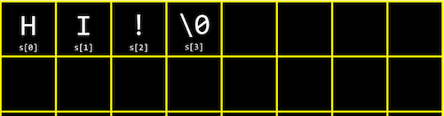
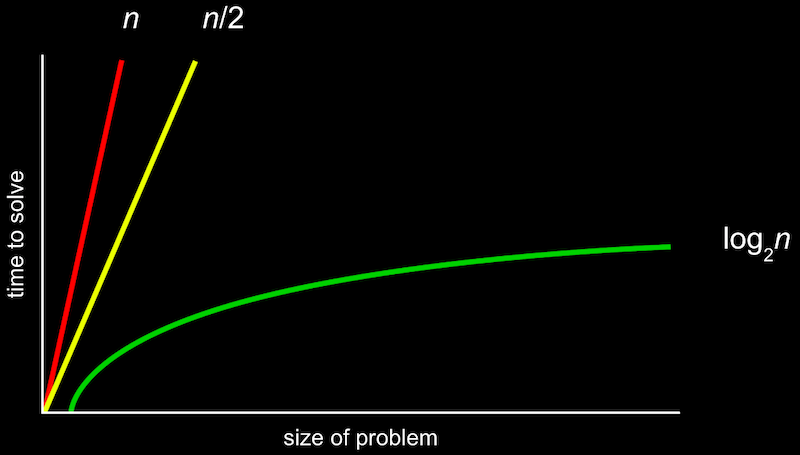
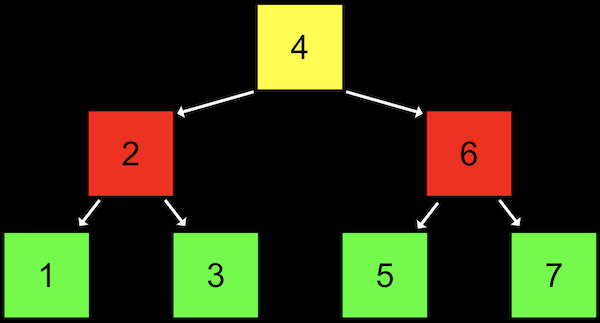

# Harvard - CS50x

## Week 0 - Scratch

### Decimal vs Binary

- Human - 010
- Machine - 1010
- bits = binary digits
- 8 bits = 1 byte

### Representing Data

- Unicode uses decimal numbers to represent characters, symbols, emojis etc.
	- The computer then converts the decimal unicode to binary numbers

### Algorithms

- Basically, using maths to find solutions more efficiently

### Pseudocode

- Using human language aka informal symtax to represent the algorithm we want to write
- Actions, conditions, boolean, loops...


## Week 1 - C

```c
#include <stdio.h>

int main(void)
{
    printf("hello, world\n");
}
```

- \n = start a new line
- printf: f stands for "format"

### Compilers

- Converts source code to machine code (binary instructions that the computer understands)

1. Preprocessing (# in our code to link libraries)
2. Compiling (from C to assembly)
3. Assembling (from assembly code to binary)
4. Linking (content of already compiled libraries are actually combined)

```bash
# generates an output file named a.out from hello.c
$ clang hello.c
```

### String

```bash
$ clang -o hello hello.c
```

- -o flag is used to name the output file

```c
#include <cs50.h>
#include <stdio.h>

int main(void)
{
    string name = get_string("What's your name?\n");
    printf("hello, %s\n", name);
}
```

- get_string is a function from cs50.h

```bash
# normally, we also need to include -lcs50 when compiling the above code
# however, we can make things easy by using "make" in terminal
# this generates an output file using the .c file name by default
make string
```

### Types, Formats, Operators

- There are other types we can use for our variables
	- `bool`, a Boolean expression of either `true` or `false`
	- `char`, a single character like `a` or `2`
	- `double`, a floating-point value with even more digits
	- `float`, a floating-point value, or real number with a decimal value
	- `int`, integers up to a certain size, or number of bits
	- `long`, integers with more bits, so they can count higher
	- `string`, a string of characters
- And the CS50 library has corresponding functions to get input of various types:
	- `get_char`
	- `get_double`
	- `get_float`
	- `get_int`
	- `get_long`
	- `get_string`
- For `printf` there are different placeholders for each type:
	- `%c` for chars
	- `%f` for floats, doubles
	- `%i` for ints
	- `%li` for longs
	- `%s` for strings
- And there are some mathematical operators we can use:
	- `+` for addition
	- `-` for subtraction
	- `*` for multiplication
	- `/` for division
	- `%` for remainder

### Syntaxes

#### Making Templates

```c
// When a placeholder is used, we need to define its value after a comma
printf("Your total is %f.\n", price * 1.0625);
```

#### For Loop

```c
#include <stdio.h>

int main(void)
{
    for (int i = 0; i < 3; i++)
    {
        printf("cough\n");
    }
}
```

#### Creating My Own Function

```c
#include <stdio.h>

void cough(int n);

int main(void)
{
    cough(3);
}

void cough(int n)
{
    for (int i = 0; i < n; i++)
    {
        printf("cough\n");
    }
}
```

#### While Loop

```c
// checks condition first then execute
while (true)
{
    printf("hello, world\n");
}
// execute first then checks condition
do
{
  n = get_int("%s", "Positive Integer: ");
}
while (n < 1);
```

#### If ... Else

```c
#include <cs50.h>
#include <stdio.h>

int main(void)
{
    int n = get_int("n: ");

    if (n % 2 == 0)
    {
        printf("even\n");
    }
    else
    {
        printf("odd\n");
    }
}
```

### Memory, Imprecision, and Overflow

- Overflow happens when we don't have enough memory (bits)/ RAM to store all possible values
- Integer overflow is when a number gets so big that it runs out of bits and "rolls over", eventually becoming 0
- Y2K happened as programs used to store year with 2 digits only, same concept applies


## Week 2 - Arrays

### Data Types

- bool 1 byte
- char 1 byte
- int 4 bytes
- float 4 bytes
- long 8 bytes
- double 8 bytes
- string ? bytes

### Arrays

```c
// declares an array with 3 integers, index starts at 0
#include <cs50.h>
#include <stdio.h>

int main(void)
{
    // Scores
    int scores[3];
    scores[0] = 72;
    scores[1] = 73;
    scores[2] = 33;

    // Print average
    printf("Average: %i\n", (scores[0] + scores[1] + scores[2]) / 3);
}
```

### Strings

- Strings are actually just arrays of characters



### Command-line Arguments

- The default return value for a main function is 0, we can change it using `return` exit code


## Week 3 - Algorithms

### Searching

- **Linear search** - move in a line when the array is not sorted

```pseudocode
For i from 0 to n-1
	If i'th element is 50
		Return true
Return false
```

- **Binary search** - divide our problem in two step

```pseudocode
If no item
	Return false
If miffle item is 50
	Return true
Else if 50 < middle item
	Search left half
Else if 50 > middle item
	Search right half
```

### Big O



- To describe run time:
	- Big O - worst case scenarios 
	- Big Ω, - best case scenarios
- Is it better to have a nice Big O or Big Ω?
	- Big O as we tend to focus on limiting the worst case/ average cases
	- Best cases scenarios are often just corner cases

### Linear Search

```c
#include <cs50.h>
#include <stdio.h>

int main(void)
{
    // An array of numbers
    int numbers[] = {4, 8, 15, 16, 23, 42};

    // Search for 50
    for (int i = 0; i < 6; i++)
    {
        if (numbers[i] == 50)
        {
            printf("Found\n");
            return 0;
        }
    }
    printf("Not found\n");
    return 1;
}
```

- Use `strcmp` in string.h to find strings

### Structs

```c
#include <cs50.h>
#include <stdio.h>
#include <string.h>

typedef struct
{
    string name;
    string number;
}
person;

int main(void)
{
  	person people[4];
  
    people[0].name = "EMMA";
    people[0].number = "617–555–0100";

    people[1].name = "RODRIGO";
    people[1].number = "617–555–0101";

    people[2].name = "BRIAN";
    people[2].number = "617–555–0102";

    people[3].name = "DAVID";
    people[3].number = "617–555–0103";
  	people
      
    // Search for EMMA
    for (int i = 0; i < 4; i++)
    {
        if (strcmp(people[i].name, "EMMA") == 0)
        {
            printf("Found %s\n", people[i].number);
            return 0;
        }
    }
    printf("Not found\n");
    return 1;      
}
```

### Sorting

#### Big O

- O(n2)
	- bubble sort, selection sort
- O(n log n)
	- merge sort
- O(n)
	- linear search
- O(log n)
	- binary search
- *O*(1)

#### Big Ω

- Ω(n2)
	- selection sort
- Ω(n log n)
	- merge sort
- Ω(n)
	- bubble sort
- Ω(log *n*)
- Ω(1)
	- linear search, binary search

#### Θ Theta

- Θ(n2)
	- selection sort
- Θ(n log n)
	- merge sort

### Recursion

- Function that calls itself
- Requires an exit that stops it from happening forever


## Week 4 - Memory

### Hexadecimal

- `0x` doesn't mean anything mathematically, but simply to say this is hexadecimal
- 16 digits: 0-9, and A-F as equivalents to 10-15
- 255 values from 00 to FF

### Addresses

- `&` operator refers to the address on the memory
- `*` operator asks the programme to go to the address

### Pointers

```c
int main(void)
{
   int n = 50;
   int *p = &n;
   printf("%p\n", p); // prints the address of n
}
```

- Pointers take up 8 bytes

### Strings

- String variable is just a pointer to the first character of the string
- Characters in strings are always stored in connected memory
- `String s` is the same as `char *s`

### Pointer Arithemetic

- `Pointer arithmetic` is mathematical operations on addresses with pointers

```c
int main(void)
{
    char *s = "HI!";
    printf("%c\n", *s); // 0x111
    printf("%c\n", *(s+1)); // 0x112
    printf("%c\n", *(s+2)); // 0x113
}
```

### Valgrind

- `valgrind` is a command-line tool that we can use to run our program and see if it has any **memory leaks**, or memory we’ve allocated without freeing, which might eventually cause out computer to run out of memory.

```c
int main(void)
{
    char *s = malloc(4); // allocates 4 bytes
    s[0] = 'H';
    s[1] = 'I';
    s[2] = '!';
    s[3] = '\0';
    printf("%s\n", s);
    free(s); // frees up the allocated memory
}
```

### Garbage Values

- `Garbage values` are unknown values that was in the memory from whatever program that was running in the computer before

### Memory Layout

- `Machine code` is the compiled program’s binary code
- `Global variables` are the variables that we declared in our program
- `Heap` is an empty area where `malloc` can get free memory for our program to use from the top down
- `Stack` is used by functions in our program as they are called, and grows upwards
- `Heap overflow/ stack overflow` may happen when we malloc too much memory and if we call too many functions

### Files

- `fopen` returns a pointer to a FILE, which can be read and written

```c
int main(void)
{
    FILE *file = fopen("phonebook.csv", "a");
    if (file == NULL)
    {
        return 1;
    }

    char *name = get_string("Name: ");
    char *number = get_string("Number: ");

    fprintf(file, "%s,%s\n", name, number);

    fclose(file);
}
```


## Week 5 - Data Structures

- `struct` to create custom data types
- `.` to access properties in a structure
- `*` to go to an address in memory pointed to by a pointer
- `->` to access properties in a structure pointed to by a pointer

### Linked Lists

- Data can be scattered around the memory but extra space is used to store a pointer to the next list

```c
// define a node
typedef struct node
{
    int number;
    struct node *next;
}
node;

int main(void)
{
		// create node pointer towards NULL
    node *list = NULL;
    // create first node
    node *n = malloc(size(node));
    if (n != NULL)
    {
      	n -> number =1; // same as (*n).number = 1;
      	n -> next = NULL;
    }
    // link list to first node
    list = n;
    // create the second node
    n = malloc(sizeof(node));
    if (n != NULL)
    {
        n->number = 2;
        n->next = NULL;
    }
    // link the second node
    list->next = n;
    // create and link the third node
    n = malloc(sizeof(node));
    if (n != NULL)
    {
        n->number = 3;
        n->next = NULL;
    }
    list->next->next = n;
  
  	// printing the whole list
  	for (node *tmp = list; tmp != NULL; tmp = tmp->next)
    {
      	printf("%i\n", tmp->number);
    }
}
```

### Trees



- Advantage: constant search time
- Disadvantage: insertion is now O(log n), and it takes more memory to store the two pointers
	- This is because the height of a binary tree is log n when it is balanced

```c
// define a node with two pointers
typedef struct node
{
    int number;
    struct node *left;
    struct node *right;
}
node;

bool search(node *tree, int number)
{
    if (tree == NULL)
    {
        return false;
    }
    else if (number < tree->number)
    {
        return search(tree->left, number);
    }
    else if (number > tree->number)
    {
        return search(tree->right, number);
    }
    else if (number == tree->number)
    {
        return true;
    }
}
```

### Hash Table


- A `hash table` uses a `hash function` to decide how we map the data
- However, a larger hash table can quickly get a lot of empty buckets
- It has an O(n) searching time in theory, but in real-world running time it's faster

### Trie


- A `trie` is a tree of arrays
- Advantage: O(1) for searhing and inserting
- Disadvantage: uses a lot of memory as the tree grows larger